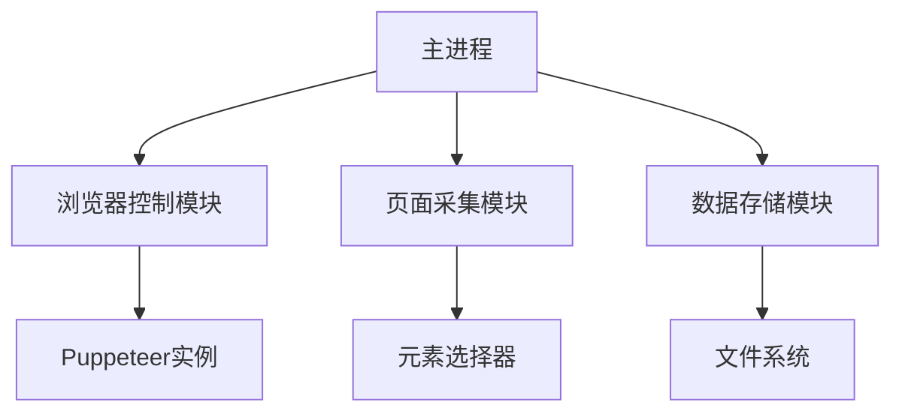

# Puppeteer爬虫实现方案

## 功能需求
1. 启动可视化Puppeteer浏览器
2. 打开指定配置页面
3. 等待用户手动登录
4. 控制台交互继续
5. 遍历采集a标签数组
6. 提取商品信息(链接/标题/店铺名)
7. 保存为JSON格式

## 技术架构


## 模块设计

### 1. 浏览器控制模块
- 使用`userDataDir`保存会话
- 启动参数: `headless: false`
- 实现控制台等待功能

### 2. 页面采集模块
- 接收a标签数组输入
- 实现新标签页跳转
- 封装采集函数:
  ```javascript
  async function scrapeProduct(page) {
    return {
      link: await page.$eval('a.product', el => el.href),
      title: await page.$eval('h1.title', el => el.innerText),
      shop: await page.$eval('div.shop', el => el.innerText)
    }
  }
  ```

### 3. 数据存储模块
- 按日期创建目录
- JSON文件格式:
  ```json
  {
    "sourceUrl": "原始链接",
    "products": [
      {
        "link": "商品链接",
        "title": "商品标题",
        "shop": "店铺名称"
      }
    ]
  }
  ```

## 实施步骤
1. 初始化项目: `npm init -y`
2. 安装依赖: `npm install puppeteer`
3. 实现核心逻辑
4. 添加错误处理
5. 测试验证